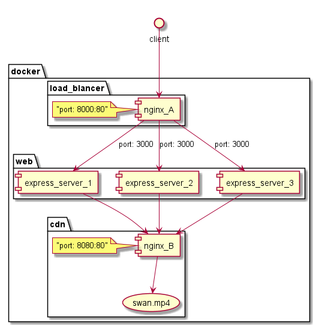

# load balancer and cdn basic

## usage and results

```
<console A>
$ docker-compose up --scale web=3

<console B>
$ for i in {1..10}; do curl http://127.0.0.1:8000; done

<console A>
web_3            | accessed
web_1            | accessed
web_2            | accessed
web_3            | accessed
web_1            | accessed
web_2            | accessed
web_3            | accessed
web_1            | accessed
web_2            | accessed
web_3            | accessed

<browser X>
access http://localhost:8000/watch_video
```

## description



## load balancer

```
$ docker-compose up --scale web=3
```

and access to http://localhost:8000/

* Web server is scaled by option `--scale SERVICE_NAME=NUM` at docker-compose.
* Each scaled server is independent because they are container.
* Nginx load balances the servers.

### remarks

1. When scale option is set, every web server port should be managed by one.

* https://github.com/docker/compose/issues/722
* https://github.com/docker/compose/issues/1241

2. scaling service cannot have `container_name`

* https://github.com/docker/compose/issues/3722

### references

* https://auth0.com/blog/load-balancing-nodejs-applications-with-nginx-and-docker/
* https://docs.nginx.com/nginx/admin-guide/load-balancer/http-load-balancer/
* https://docs.nginx.com/nginx/admin-guide/monitoring/logging/
* https://github.com/docker/compose/issues/3722
* https://levelup.gitconnected.com/load-balance-and-scale-node-js-containers-with-nginx-and-docker-swarm-9fc97c3cff81
* https://pspdfkit.com/blog/2018/how-to-use-docker-compose-to-run-multiple-instances-of-a-service-in-development/

## cdn basic

```
$ docker-compose up
```

and access to http://localhost:8000/watch_video

* Docker just hosts swan.mp4 when container is up.
* To understand "mechanism", access protection and any other complex setting are not written.

### references

* https://idiallo.com/blog/creating-your-own-cdn-with-nginx
* https://pasztor.at/blog/building-your-own-cdn/
* https://seo-hacker.com/implement-selfhosted-cdn-site-speed/
* https://dzone.com/articles/build-your-own-cdn-in-5-steps
* https://community.akamai.com/customers/s/article/How-to-make-a-simple-CDN-for-testing?language=en_US
* https://metinsaylan.com/6065/create-cdn-server-using-nginx/

### video from

* https://www.videvo.net/video/swan-1/4320/
